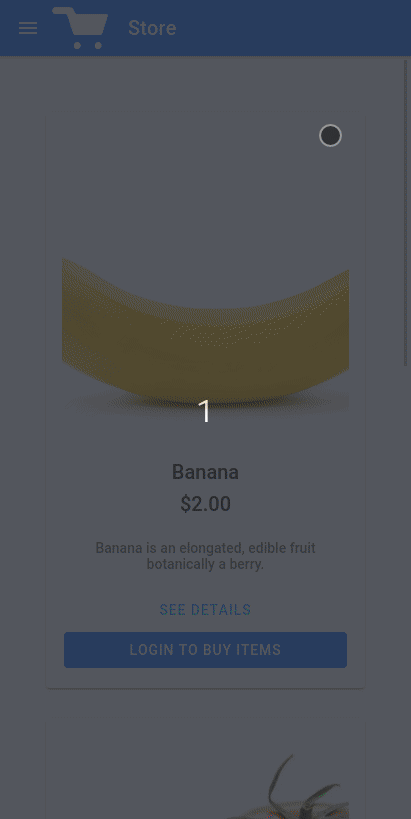
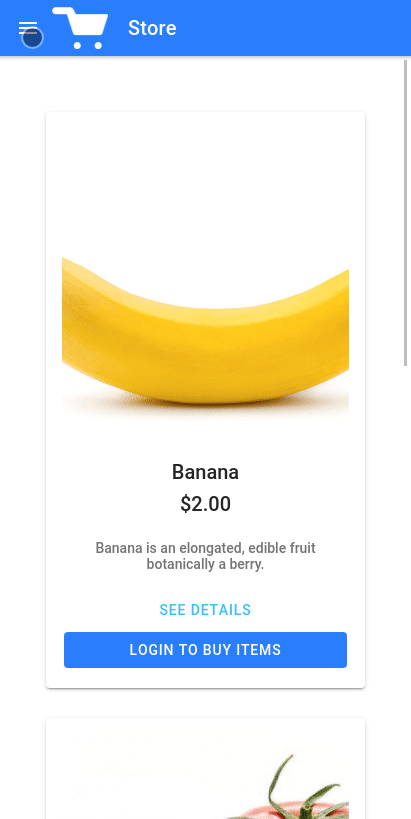
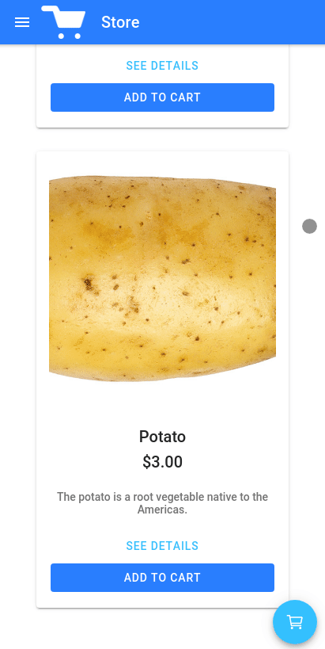
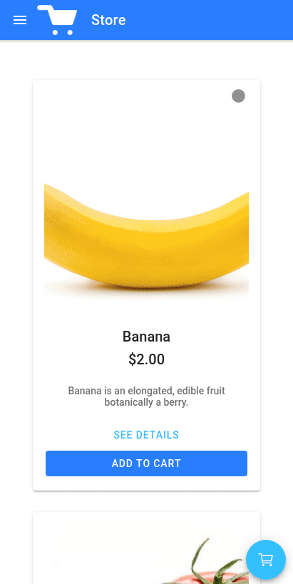
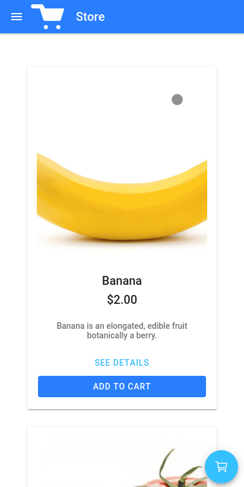

<!-- PROJECT LOGO --> 

  <h3 align="center">IoniShop</h3>
  
A Custom Shop made with Ionic

   
   

  

    <a href="https://github.com/miguelcanosantana/IoniShop/issues">Report Bugs</a>
  

 
 

## About The Project
This App is made in Ionic, it allows you to:
* Create your Own Shop.
* Customize Style in real time and saved to FireStore.
* Buy Items and Products.
* And more is in the way :D
 

## Usage of the App
 

### Register

 
  

 
 

### Login

 
  

 
 

### Multiple ways of adding Items to the Cart

 
  
  

 
 

### Create Products

 
  

 
 

### Preview and upload custom themes in real time

 
  

 
 

### And more to come!

 

 
 

## That's All Folks!
